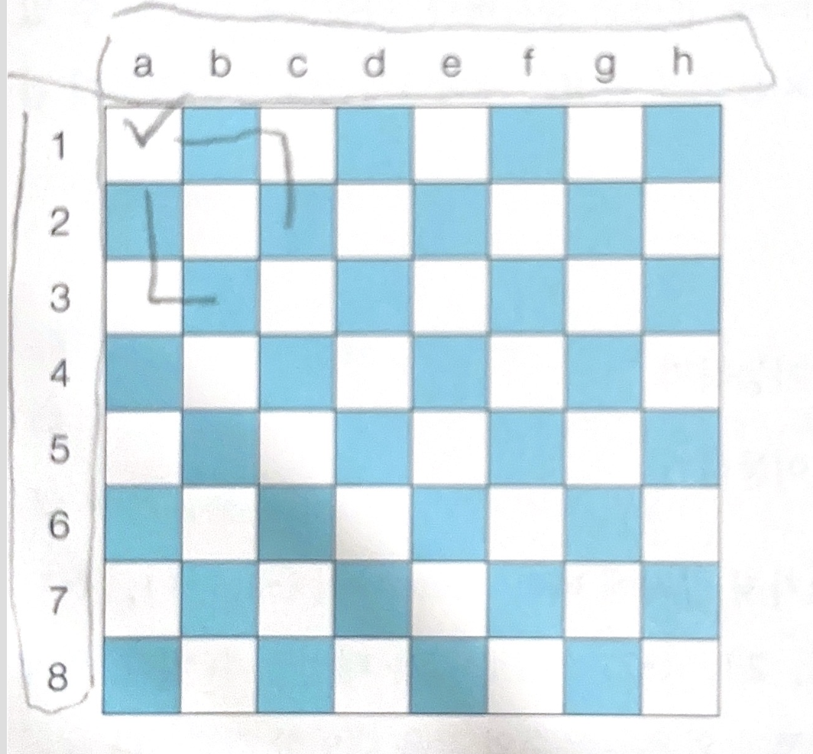

## 문제 풀이 과정

행복 왕국의 왕실 정원은 체스판과 같은 8 x 8 좌표 평면이다. 왕실 정원의 특정한 한 칸에 나이트가 서 있다.  
나이트는 매우 충성스러운 신하로서 매일 무술을 연마합니다.

나이트는 말을 타고 있기 때문에 이동을 할 때는 L자 형태로만 이동할 수 있으며 정원 밖으로는 나갈 수 없습니다.  
나이트는 특정한 위치에서 다음과 같은 2가지 경우로 이동할 수 있습니다.

1. 수평으로 두 칸 이동한 뒤에 수직으로 한 칸 이동하기
2. 수직으로 두 칸 이동한 뒤에 수평으로 한 칸 이동하기



이처럼 8 x 8 좌표 표면상에서는 나이트의 위치가 주어졌을 때 나이트가 이동할 수 있는 경우의 수를 출력하는 프로그램을 작성해야 합니다.  
이때 왕실의 정원에서 행 위치를 표현할 때는 1부터 8로 표현하며, 열의 위치를 표현할 때는 a부터 h로 표현합니다.

예를 들어 만약 나이트가 a1에 있을 때 이동할 수 있는 경우의 수는 2가지 입니다. a1의 위치는 좌표 평면에서 구석의 위치에 해당하며  
나이트는 정원 밖으로 나갈 수 없기 때문입니다.

일단 전 문제인 상하 좌우 처럼 이동 부분을 의미하는 좌표를 추가해야 한다.
```java
// 나이트가 이동할 수 있는 8가지 방향 정의
int[] dx = {-2, -1, 1, 2, 2, 1, -1, -2};
int[] dy = {-1, -2, -2, -1, 1, 2, 2, 1};

```
다음과 같이 나이트가 이동할 수 있는 방향을 8가지로 정할 수 있다.
그렇다면 이제 현재 나이트의 위치를 입력 받아야 된다.

```java
// 현재 나이트의 위치 입력받기
String inputData = sc.nextLine();
int row = inputData.charAt(1) - '0';
int column = inputData.charAt(0) - 'a' + 1;
```

8가지 방향에 대하여 각 위치로 이동이 가능한지 확인
```java
for (int i = 0; i < 8; i++) {
    // 이동하고자 하는 위치 확인
    int nextRow = row + dx[i];
    int nextColumn = column + dy[i];
    // 해당 위치로 이동이 가능하다면 카운트 증가
    if (nextRow >= 1 && nextRow <= 8 && nextColumn >= 1 && nextColumn <= 8) {
        result += 1;
    }
}
```

## 최종 구현
```java
import java.util.*;

public class Main {

    public static void main(String[] args) {
        Scanner sc = new Scanner(System.in);

        // 현재 나이트의 위치 입력받기
        String inputData = sc.nextLine();
        int row = inputData.charAt(1) - '0';
        int column = inputData.charAt(0) - 'a' + 1;

        // 나이트가 이동할 수 있는 8가지 방향 정의
        int[] dx = {-2, -1, 1, 2, 2, 1, -1, -2};
        int[] dy = {-1, -2, -2, -1, 1, 2, 2, 1};

        // 8가지 방향에 대하여 각 위치로 이동이 가능한지 확인
        int result = 0;
        for (int i = 0; i < 8; i++) {
            // 이동하고자 하는 위치 확인
            int nextRow = row + dx[i];
            int nextColumn = column + dy[i];
            // 해당 위치로 이동이 가능하다면 카운트 증가
            if (nextRow >= 1 && nextRow <= 8 && nextColumn >= 1 && nextColumn <= 8) {
                result += 1;
            }
        }

        System.out.println(result);
    }

}
```